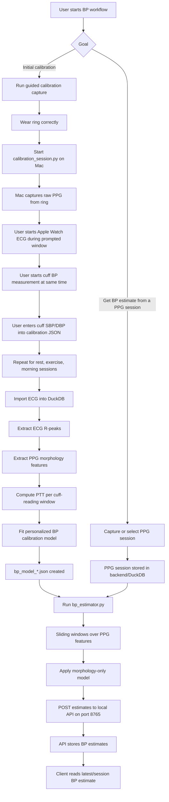
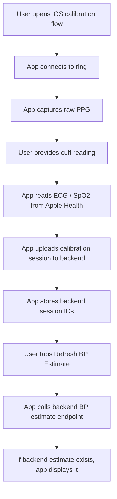
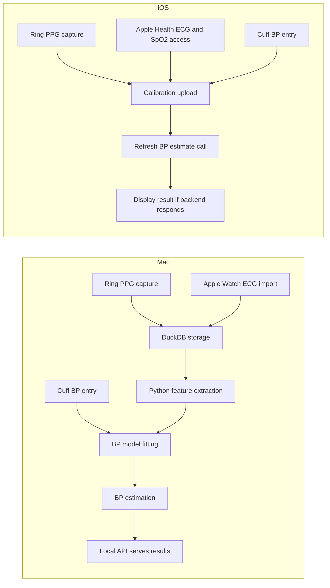

# BP Estimate Flow: Mac Pipeline vs iOS App

This document explains how BP estimation currently works on the Mac, what the user has to do, what each tool/script is responsible for, how the iOS implementation compares, and what must be in place for the iOS app to show the same BP estimate behavior as the Mac setup.

It is based on:
- `/Users/pravinsail/OpenCircuit-master/desktop/`
- `/Users/pravinsail/OpenCircuit-master/docs/BLE_INVESTIGATION_LOG.md`
- `/Users/pravinsail/OpenCircuit-master/docs/HANDOFF_MACOS_IOS.md`
- `/Users/pravinsail/OpenCircuit-master/claude session .md`

## Executive Summary

The Mac pipeline is a multi-stage system:
- the ring provides raw PPG
- Apple Watch ECG provides timing anchors for calibration
- a cuff provides ground-truth BP for calibration
- a local backend stores and serves sessions
- Python scripts extract features, fit a personalized model, and generate BP estimates

The iOS app currently implements:
- ring BLE capture and sync
- raw PPG capture support
- Apple Health ECG and SpO2 ingestion for calibration payloads
- calibration session upload
- BP estimate refresh via API

The iOS app does not currently implement the full estimator locally. It depends on the same backend-style estimation path that the Mac pipeline uses.

## High-Level Flow



## Detailed Mac Process

### 1. User prerequisites

The user needs:
- RingConn ring with good finger fit
- Mac with BLE access
- local `health-local-core` backend running on port `8765`
- a valid DuckDB used by both backend and scripts
- Apple Watch ECG data available in the backend DB
- a BP cuff for calibration ground truth

### 2. What the user does during calibration

The user runs:
- `calibration_session.py <ring-uuid> rest`
- `calibration_session.py <ring-uuid> exercise`
- `calibration_session.py <ring-uuid> morning`

During each session:
- the script starts ring PPG capture
- the user stays still or follows the state instructions
- for each reading window, the user starts Apple Watch ECG and cuff measurement together
- the user reads cuff BP and types SBP/DBP into the terminal

Outputs:
- `ppg_calibration_<state>_<timestamp>.csv`
- `ppg_calibration_<state>_<timestamp>.log`
- `calibration_<state>_<timestamp>.json`

### 3. What each Mac tool does

#### `calibration_session.py`
- orchestrates the calibration session
- prompts the user when to record ECG and cuff BP
- records exact wall-clock windows for later alignment

#### `capture_ppg.py`
- captures raw multi-channel PPG from the ring
- writes PPG CSV output used later for import/analysis

#### `ppg_watch.py`
- watches new PPG CSV files
- imports them to the local backend API

#### `ecg_rpeaks.py`
- reads Apple Watch ECG from DuckDB
- detects R-peaks
- writes `ecg_rpeaks_*.csv`

#### `ppg_feature_extractor.py`
- reads PPG samples from DuckDB
- reconstructs pulse waveforms
- extracts per-pulse features such as:
  - `ai_pct`
  - `ri`
  - `rise_time_ms`
  - `pw50_ms`
  - `has_notch`
- writes `ppg_features_<session_id>.csv`

#### `ptt_calculator.py`
- aligns ECG R-peaks with the next PPG foot
- computes PTT for each calibration reading window
- combines PTT and morphology with cuff BP
- writes `ptt_calibration_*.csv`

#### `bp_calibration.py`
- reads one or more `ptt_calibration_*.csv`
- fits personalized Ridge regression models
- saves:
  - PTT-based calibration models
  - morphology-only models
- writes:
  - `bp_model_*.json`
  - `bp_predictions_*.csv`

#### `bp_estimator.py`
- loads a `bp_model_*.json`
- reads or generates `ppg_features_<session_id>.csv`
- creates sliding windows across the PPG session
- applies morphology-only models
- estimates SBP/DBP without ECG
- posts the results to the API:
  - `/ppg/sessions/{session_id}/bp_estimate`

#### `spo2_calibrator.py`
- calibrates PPG-derived SpO2 against reference SpO2
- separate from BP, but part of the same physiological pipeline

## Mac Flowchart in Detail

```mermaid
flowchart TD
    A1[User launches local backend on Mac] --> A2[API health check on 127.0.0.1:8765]
    A2 --> A3[User runs calibration_session.py]
    A3 --> A4[Script starts capture_ppg.py]
    A4 --> A5[Ring raw PPG captured to CSV/log]
    A5 --> A6[PPG imported to backend/DuckDB]

    A3 --> B1[Prompt: start Apple Watch ECG]
    A3 --> B2[Prompt: start cuff measurement]
    B1 --> B3[ECG later exported/imported to DuckDB]
    B2 --> B4[User types SBP/DBP into calibration JSON]

    A6 --> C1[ppg_feature_extractor.py]
    B3 --> C2[ecg_rpeaks.py]
    B4 --> C3[calibration_*.json]

    C1 --> D1[PPG morphology features]
    C2 --> D2[R-peak timestamps]
    C3 --> D3[Reading windows + cuff truth]

    D1 --> E1[ptt_calculator.py]
    D2 --> E1
    D3 --> E1
    E1 --> F1[ptt_calibration_*.csv]
    F1 --> G1[bp_calibration.py]
    G1 --> H1[bp_model_*.json]

    A6 --> I1[New or existing PPG session]
    H1 --> J1[bp_estimator.py]
    I1 --> J1
    J1 --> K1[Windowed SBP/DBP estimates]
    K1 --> L1[POST to /ppg/sessions/{session_id}/bp_estimate]
    L1 --> M1[Stored estimates available to clients]
```

## What the BP Model Actually Uses

There are two related model types.

### Calibration-time model

Used during personalized setup:
- cuff SBP/DBP as truth
- ECG-to-PPG timing as PTT
- PPG morphology features

This is the stronger setup because it uses both timing and shape information.

### Estimation-time model

Used for later continuous estimation:
- PPG morphology only
- no ECG required

This is why `bp_estimator.py` can estimate BP from a normal PPG session after calibration has already been completed.

## Existing Calibration Evidence

The current workspace already contains completed calibration artifacts:
- `calibration_rest_20260627_221304.json`
- `calibration_exercise_20260627_214451.json`
- `calibration_morning_20260628_080920.json`
- `ptt_calibration_20260627_221304.csv`
- `ptt_calibration_20260627_214451.csv`
- `ptt_calibration_20260628_080920.csv`
- `bp_model_20260628_093702.json`

That means the Mac side is not a blank system. It already has a first calibrated BP pipeline.

## Current iOS Implementation

### What is already implemented in iOS

The iOS app currently has the following capabilities in the recent work:
- BLE ring session support
- raw PPG capture support from the ring
- calibration session UI and payload handling
- upload of PPG CSV / ECG / metadata
- BP estimate refresh call to the backend
- Apple Health ECG and SpO2 used as calibration references

Conceptually, the iOS flow is:



### What iOS does not currently do locally

The iOS app does not currently:
- run the Python estimator stack on-device
- run DuckDB + SciPy + NumPy pipeline on-device
- fit the BP model locally
- generate BP estimates entirely inside the app without backend help

So the iOS app today is best understood as:
- a client that captures and uploads the right ingredients
- a client that asks the backend for the result

## Why the iOS BP Refresh Fails Today

The Xcode logs show repeated failures to:
- `http://127.0.0.1:8765/ppg/bp_estimate/latest`

That means:
- the app asked for a BP estimate
- no service was listening at that address from the iOS runtime point of view

This is not the same as saying:
- BLE failed
- ring capture failed
- cuff calibration failed

It specifically means the estimate retrieval path failed at the backend/network boundary.

## Mac vs iOS Comparison



## What Must Be In Place for iOS to Match the Mac BP Estimate

For the iOS app to successfully show the same BP estimate behavior as the Mac flow, the following must be true.

### 1. The backend must be reachable from the app

If testing on simulator on the same Mac:
- `127.0.0.1:8765` can work if the simulator can reach the Mac-hosted service in that setup

If testing on a physical iPhone:
- `127.0.0.1` will point to the phone, not the Mac
- the app must use a LAN IP or remote server URL instead

### 2. The backend must have the right imported session

The estimate can only exist if:
- the uploaded session really reached the backend
- the backend stored it in the correct DB
- the estimator ran against that same DB/session

### 3. Calibration must already exist

The continuous estimator depends on a fitted calibration model. That means:
- `bp_model_*.json` must already exist
- it must correspond to the same user/person
- it should have been trained from valid calibration sessions

### 4. The estimator must be executed

Even if calibration exists, the backend still needs to run:
- `bp_estimator.py <session_id>`

Without that step:
- there may be a session
- there may be a model
- but no stored BP estimate rows yet

### 5. The API and scripts must use the same DuckDB

This is a key operational dependency.

Observed risk:
- the local API reports a DB path under `/data/db/healthlocal.duckdb`
- desktop scripts default to `/Users/pravinsail/HealthLocal/db/healthlocal.duckdb`

If those are not the same DB:
- import can happen in one place
- estimation can read from another place
- the app can ask the API for results that were never written into the DB it serves

## Practical Test Matrix

### Mac-only validation

To validate the Mac path cleanly:
- backend is running and healthy
- target PPG session appears in the backend DB
- `ppg_feature_extractor.py` works for that session
- `bp_model_*.json` exists
- `bp_estimator.py` posts windowed estimates successfully
- API endpoint returns the stored estimate

### iOS parity validation

To validate iOS against Mac:
- confirm the iOS app uploads the same sort of PPG session payload as Mac import
- confirm the backend creates a `ppg_session_id`
- run `bp_estimator.py` for that exact session ID
- confirm the API returns the estimate for that session
- confirm the app refreshes and displays that same estimate

## Customer Journey View

### On Mac

The user journey is:
- wear ring
- run guided calibration
- use Apple Watch ECG and cuff during prompts
- let the backend and scripts process the data
- retrieve estimated BP from the local service

This is a technical workflow, not a product-polished consumer workflow.

### On iOS

The intended journey is simpler:
- connect ring
- complete calibration
- app uploads data
- app fetches estimate
- app displays BP estimate

But for this to feel reliable, the product must clearly separate:
- capture completed
- calibration uploaded
- backend analysis pending
- backend unavailable
- estimate ready

## Recommended Operating Model Right Now

The cleanest current operating model is:
- treat Mac as the BP estimation engine
- treat iOS as the capture and display client
- keep model fitting and estimation on the backend path until there is a Swift-native estimator

That means iOS parity is achieved by making sure:
- the app uploads the same session data correctly
- the Mac/backend runs the same estimator against that session
- the app fetches from a reachable backend address

## Bottom Line

The Mac pipeline already contains the actual BP estimation machinery.

The iOS app currently contains:
- capture
- calibration payload assembly
- backend estimate refresh

The missing parity is not mainly BLE anymore. It is this chain:
- backend reachability
- shared DB consistency
- estimator execution for the uploaded session
- result retrieval by the app

If those four conditions are satisfied, the iOS app can show the same BP estimate outcome as the Mac flow, even without moving the BP algorithm into native iOS code.
